# peterbot

> Personal AI agent that runs 24/7 on Railway

peterbot is a Telegram-based AI assistant that handles quick questions instantly and background tasks through a worker queue. It uses Claude for AI capabilities and E2B for secure code execution in sandboxes.

**Core Flow**: Telegram → Intent Detection → (Quick Reply | Background Task) → E2B Sandbox → Results Delivery

## Quick Start

Prerequisites: [Bun](https://bun.sh) runtime

```bash
# Install dependencies
bun install

# Copy and fill in your API keys
cp .env.example .env
# Edit .env with your actual API keys

# Initialize database
bun run db:push

# Start development server
bun run dev
```

## Dashboard Access

The web dashboard provides a UI for managing your bot:

- **Production**: `http://localhost:3000` (when running `bun run start`)
- **Development**: `http://localhost:5173` (when running `bun run web:dev`)

Login with the `DASHBOARD_PASSWORD` from your `.env` file.

**Pages:**
- **Overview** - System status and recent jobs
- **Soul** - Edit `soul.md` (AI personality)
- **Memory** - Edit `memory.md` (system prompt context)
- **Config** - Manage blocklist patterns
- **Monitor** - View and manage all jobs
- **Console** - Execute code in E2B sandbox

## API Keys Setup

You'll need 4 API keys to run peterbot:

| Key | Where to Get | Cost |
|-----|-------------|------|
| `TELEGRAM_BOT_TOKEN` | [@BotFather](https://t.me/BotFather) on Telegram | Free |
| `TELEGRAM_CHAT_ID` | Send message to bot, visit `https://api.telegram.org/bot<TOKEN>/getUpdates` | Free |
| `ANTHROPIC_API_KEY` | [console.anthropic.com](https://console.anthropic.com) | Pay per use |
| `E2B_API_KEY` | [e2b.dev/dashboard](https://e2b.dev/dashboard) | Free tier available |

### Getting Your Telegram Chat ID

1. Send a message to your bot on Telegram
2. Visit: `https://api.telegram.org/bot<YOUR_BOT_TOKEN>/getUpdates`
3. Look for `"chat":{"id":123456789,...}`
4. Copy the number (including the minus sign if present)

## Available Commands

```bash
bun run dev          # Start with hot reload
bun run start        # Production start
bun test             # Run test suite
bun run db:push      # Push schema to database
bun run db:studio    # Open Drizzle Studio
bun run tracer       # Run god script to verify database
bun run web:dev      # Start Vite dev server (port 5173)
Bun run web:build    # Build frontend for production
bun run build        # Build frontend for production
```

| Command | Description |
|---------|-------------|
| `bun run web:dev` | Start Vite dev server (port 5173) |
| `bun run web:build` | Build frontend for production |
| `bun run build` | Build frontend for production |
| `bun run start` | Start production server (serves React SPA) |

## Development Workflow

**Development mode** (two terminals):
```bash
# Terminal 1 - Backend API
bun run dev

# Terminal 2 - Frontend dev server (proxies /api to :3000)
bun run web:dev
```

**Production mode** (single command after build):
```bash
bun run build      # Build frontend into web/dist/
bun run start      # Start server with NODE_ENV=production
```

In development, Vite serves the React app on port 5173 and proxies `/api` requests to the backend on port 3000. In production, the Hono server serves the built React SPA directly from `web/dist/`.

## Telegram Commands

Once your bot is running, interact with it via Telegram:

| Command | Description |
|---------|-------------|
| `/start` | Introduction message |
| `/status` | View all jobs (pending, running, completed, failed) |
| `/retry [jobId]` | Retry a failed job |
| `/get [jobId]` | Retrieve completed job result |
| *(regular message)* | Auto-detected as quick question or background task |

### Message Types

**Quick Questions** - Answered instantly (no job created):
- "What is 2 + 2?"
- "Explain quantum computing"
- "Write a haiku about coding"

**Background Tasks** - Queued and processed asynchronously:
- "Analyze this CSV and create a chart"
- "Scrape data from example.com"
- "Generate a PDF report"

## Deployment

### Railway (Recommended)

1. Push code to GitHub
2. Create new Railway project from GitHub repo
3. Add environment variables in Railway dashboard
4. Railway auto-detects Bun and deploys using `railway.toml` config
5. Verify deployment by checking logs for "Bot @yourbot is running"

### Environment Variables for Railway

```
TELEGRAM_BOT_TOKEN
TELEGRAM_CHAT_ID
ANTHROPIC_API_KEY
E2B_API_KEY
DASHBOARD_PASSWORD (required - sets login password for web dashboard)
PORT (optional, defaults to 3000)
SQLITE_DB_PATH (optional, defaults to ./data/jobs.db)
```

## Architecture

peterbot follows the **tracer bullet methodology** - a working end-to-end flow from day one, with features added incrementally.

### Directory Structure

```
src/
├── core/           # Telegram bot, HTTP server, worker
├── features/       # Domain modules (jobs, AI, etc.)
├── shared/         # Utilities, config, types
├── ai/             # Vercel AI SDK integration
└── db/             # Drizzle ORM setup
```

### Ejection Points

The codebase is designed to evolve:

1. **Single-user → Multi-user**: Remove auth guard in `src/core/telegram/handlers.ts`
2. **Heuristic → AI intent detection**: Replace `detectIntent()` with AI-based classification
3. **Flat memory → Vector search**: Add vector database for conversation history

See [`2026-02-17-peterbot-design.md`](./2026-02-17-peterbot-design.md) for full architectural details.

## Testing

All features have comprehensive test coverage:

```bash
# Run all tests
bun test

# Run tests in watch mode
bun run test:watch
```

Tests use in-memory SQLite for isolation. See `src/features/jobs/jobs.test.ts` for the testing pattern.

**Green checkpoint approach**: Tests must pass before moving to the next phase.

## Local Smoke Test Checklist

Before deploying, verify locally:

- [ ] `.env` created from `.env.example` with all API keys including `DASHBOARD_PASSWORD`
- [ ] Database initialized: `bun run db:push` creates `data/jobs.db`
- [ ] God script passes: `bun run tracer` → "🎉 GOD SCRIPT PASSED"
- [ ] All tests pass: `bun test` → zero failures
- [ ] **Dashboard login**: Visit `http://localhost:3000`, enter password, verify login succeeds
- [ ] **Dashboard navigation**: Visit each page (Overview, Soul, Memory, Config, Monitor, Console), verify no errors
- [ ] **Soul editing**: Edit `soul.md`, save, verify success toast appears
- [ ] **Memory editing**: Edit `memory.md`, save, verify success toast appears
- [ ] **Config management**: Add a blocklist pattern, verify save succeeds
- [ ] **Job monitoring**: View jobs on Monitor page, expand a job to see details
- [ ] **Dev Console**: Execute code in Console page, verify output appears
- [ ] **Auto-refresh**: Verify Monitor page refreshes automatically (15-second interval)
- [ ] **Auth protection**: Verify password protection blocks unauthenticated API calls
- [ ] Telegram `/start` returns welcome message
- [ ] Quick question answered instantly
- [ ] Background task creates job ID
- [ ] Worker processes job and delivers result

## Sequence Diagram


## Deployment Flow

```mermaid
sequenceDiagram
    participant Dev as Developer
    participant Railway
    participant Nixpacks
    participant Bun as Bun Runtime
    participant Hono as Hono Server

    Dev->>Railway: git push
    Railway->>Nixpacks: Trigger build
    Nixpacks->>Bun: bun install (root)
    Nixpacks->>Bun: cd web && bun install
    Nixpacks->>Bun: bun run build → web/dist/
    Nixpacks-->>Railway: Build artifact ready
    Railway->>Bun: bun run start (NODE_ENV=production)
    Bun->>Hono: Mount /api routes
    Bun->>Hono: serveStatic({ root: './web/dist' })
    Hono-->>Railway: Listening on PORT
```



## License

MIT
